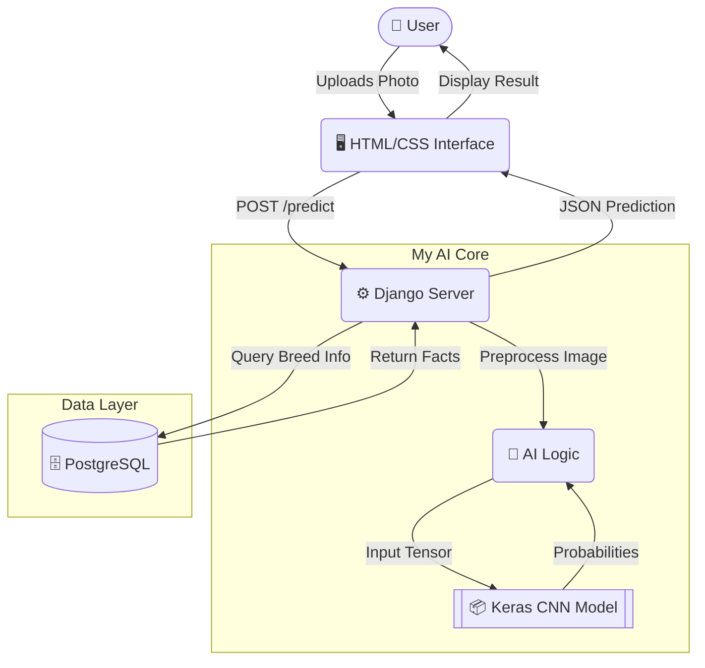
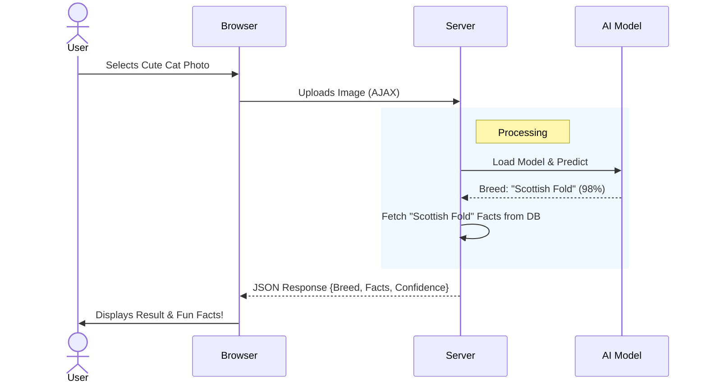

# 🐱 Purrfect Predictor


Hey there! 👋 Welcome to **Purrfect Predictor**, a project I built to solve a very serious problem: identifying cute cats!

I used Deep Learning to train a custom AI model that can tell apart **67 different cat breeds** with high accuracy. It's not just a wrapper around an API; I actually fine-tuned a Convolutional Neural Network (CNN) on over 100,000 images to get this right. The goal was to build something robust, scalable, and—most importantly—cute.

***

## 🎨 How I Built It (Visualized)

I wanted to visualize exactly how the app works, so I created these diagrams to show you the architecture I designed.

### The Stack Architecture
Here is how the Django Backend talks to my custom AI Model. I designed the backend to serve both the web pages and the prediction API efficiently.



### The User Journey
Here is a flowchart of what happens under the hood when you click that "Identify Breed" button:



***

## 🛠️ My Tech Stack

| Component | Technology | Why I chose it |
|-----------|------------|----------------|
| **Frontend** | HTML5 / CSS3 / JS | To build a custom, responsive, and "cute" aesthetic without the overhead of a heavy framework. |
| **Backend** | Django 4.2 | For its robust security and ease of integrating Python ML libraries. |
| **AI Model** | TensorFlow / Keras | I used MobileNetV2 Transfer Learning to get high accuracy with a smaller model size. |
| **Database** | PostgreSQL | For reliable, production-grade data storage on Railway. |
| **Deployment** | Railway | Because it handles Docker builds and Python dependencies seamlessly. |

***

## 🚀 How to Run It

If you want to run my project on your own machine, here is how you do it:

1. **Clone the Repo**
   ```bash
   git clone https://github.com/your-username/cat-breed-classifier.git
   cd cat-breed-classifier
   ```

2. **Install Dependencies**
   ```bash
   pip install -r requirements.txt
   ```

3. **Run the Server**
   ```bash
   # I set it up so you can run it from the backend folder
   cd backend
   python manage.py runserver
   ```

4. **Visit** `http://127.0.0.1:8000` 😻

***

## 📂 Project Structure
I organized the project to keep the ML logic separate from the web logic for better maintainability.

```mermaid
graph LR
    Root[📁 Project Root]
    
    Root --> Backend[📁 backend/]
    Root --> Models[📁 models/]
    Root --> Config[📄 Procfile & nixpacks.toml]
    
    Backend --> Django[⚙️ Django App]
    Backend --> Static[🎨 Static (CSS/JS/Images)]
    Backend --> Templates[📝 HTML Templates]
    
    Models --> Keras[🧠 .keras Model File]
    
    style Root fill:#f9f,stroke:#333
    style Backend fill:#bbf,stroke:#333
    style Models fill:#bfb,stroke:#333
```

***

Made with 💖 (and a lot of coffee) by Me!